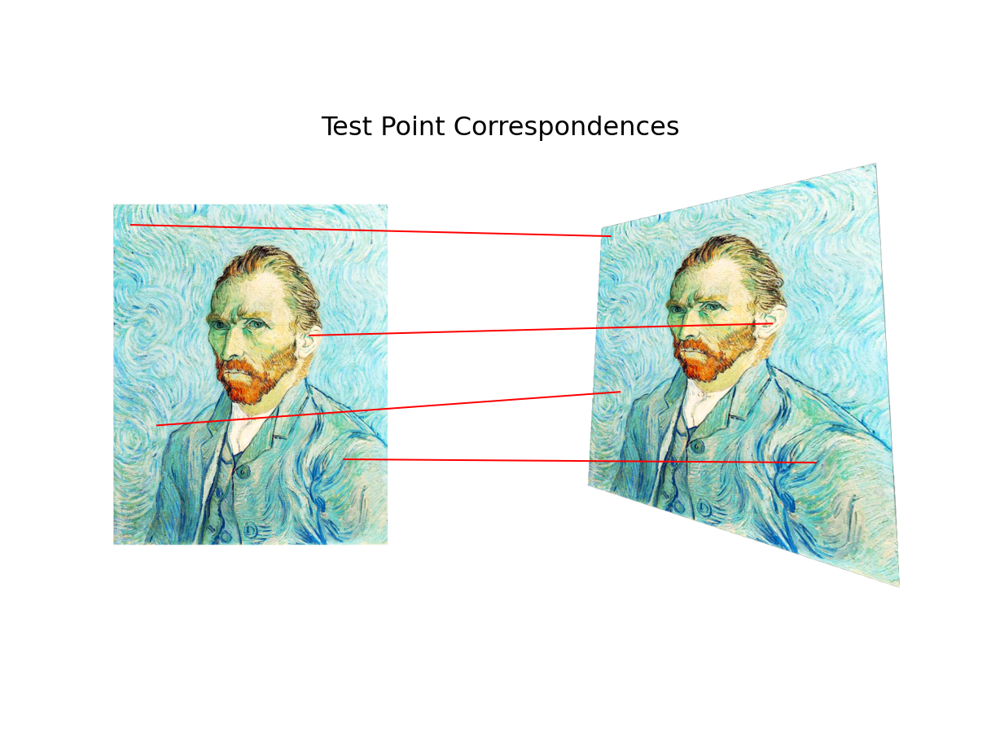
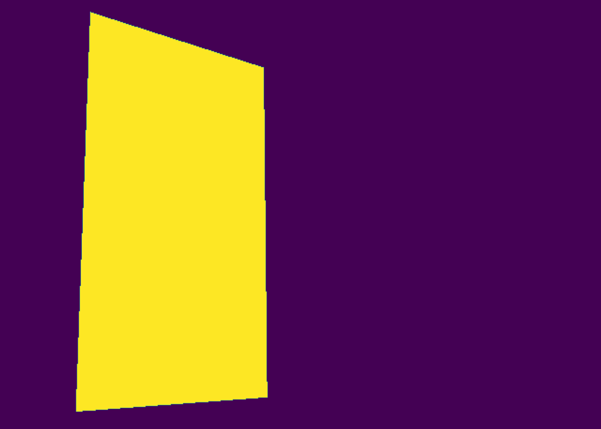
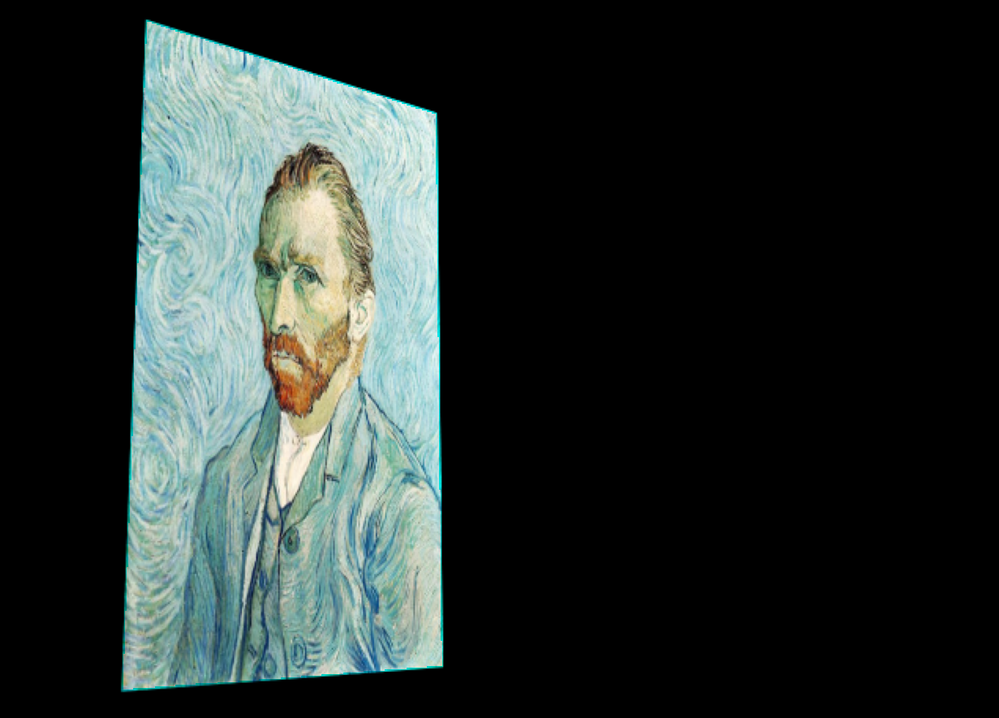
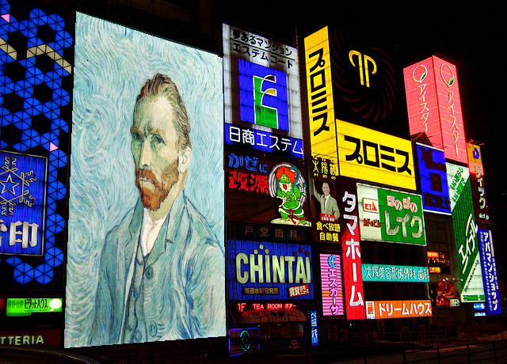
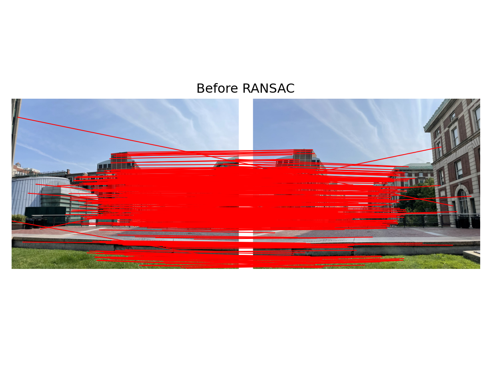
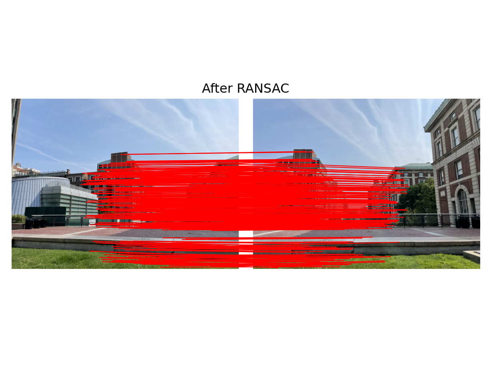
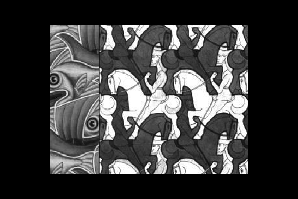
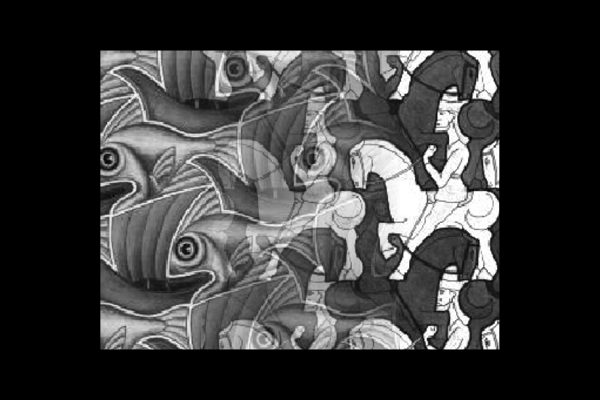
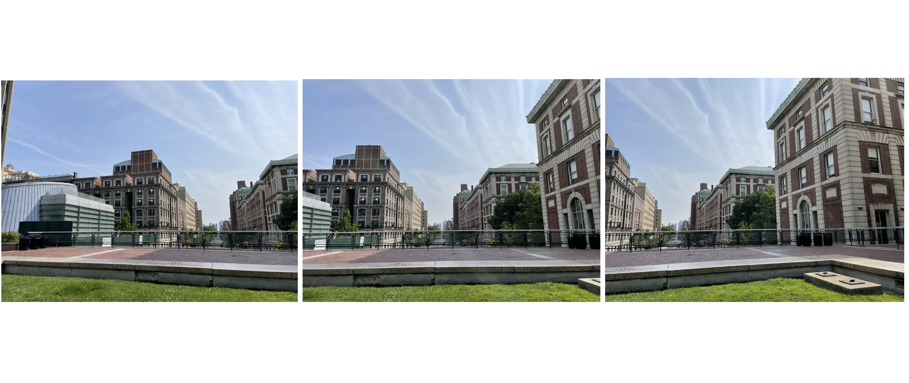
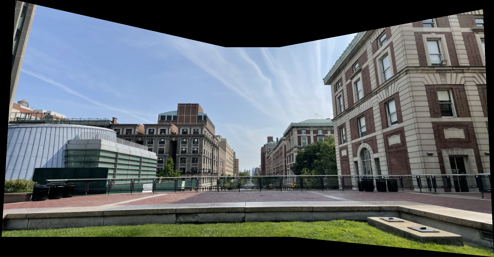

# Image-Panorama
Stephen Pasch (10/16/23) Assignment for Computer Vision 1: First Principals. 

Directory Structure:
* solutions_ssp2188.py : file containing all code nessasary to computing the image panoramas
* runHW4.py (Not written by me): file to run the assignment sections individually for testing
* utils.py (Not written by me): a file containing utility functions used in the project.
* results: subdirectory containing all result images.

A computer vision project that creates image panoramas given a list of images that have been taken from the same location at different angles. My original solution took about two minutes to stitch three medium-resolution images together. This is the optimized version, where it takes on average 3-6 seconds to accomplish the same task. 

## Functions

 **1. Compute Homography** 

`compute_homography(src_pts, dest_pts) -> homography`

The function computes a homography matrix relating the given ordered matching source and destination points. This can be done by creating a system of linear equations, solving it,  and then minimizing its eigenvalue. The minimum eigenvalue will correspond to the minimum eigenvector, which is the solution homography. 

Args:

        src_pts (np.ndarray): Nx2 matrix of source points
        dest_pts (np.ndarray): Nx2 matrix of destination points
Returns:

        np.ndarray: 3x3 homography matrix  
        
        
**2. Apply homography**

`apply_homography(H, test_pts) -> transformed_pts`

The function applies the given homography(mapping) to the given source points. Then the function will output the transformed points. 

Args:

        H (np.ndarray): 3x3 homography matrix
        test_pts (np.ndarray): Nx2 matrix of points to transform
Returns:

        transformed_pts(np.ndarray): Nx2 matrix of points transformed by tomography

Figure 1: By computing the homography with a set of 4 matching points between an image and its warped counterpart. That homography can be applied to any points, and they will be mapped to their corresponding points in the destination image. 

**3. Backward warp Image**

`backward_warp_img(src_img, H_inv, dest_canvas_width_height) -> (warped_img, binary_mask)`

The function takes an image (src_img) and warps it to the coordinate space of another (destination) image. This is done by applying the inverse homography to the coordinates of the destination image to bring them into the space of the source image. Then map the source image pixels into the destination image. Return the warped source image. Then also returns a binary mask of the warped image in the destination image space. 

  Args:
    
        src_img (np.ndarray): Nx2 source points
        H_inv (np.ndarray): 3x3 inverse of the src -> dest homography
        dest_canvas_width_height (Tuple[int, int]): size of the destination image

  Returns:
  
        Tuple[np.ndarray, np.ndarray]: (binary mask where the destination image is filled in, final image)

Figure 2: Binary Mask returned corresponding to the warped image (Figure 3).

Figure 3: Resultant warped source image that is now mapped to the coordinates of the destination image.

**4. Warp Image Onto**

`warp_img_onto(src_img, dest_img,  src_pts, dest_pts) -> composite_img`

Given a source image, destination image, and matching source and destination points, return the resultant image of the source image overlayed onto the destination. 

Args:

        src_img (np.ndarray): source image
        dest_img (np.ndarray): destination image
        src_pts (np.ndarray): Nx2 source points
        dest_pts (np.ndarray): Nx2 destination points

Returns:

        np.ndarray: resulting image with the source image warped on the 
        destination image

Figure 4: The result of warping the Monet portrait onto a billboard in this picture of an Osaka street. The portrait was the source image and Osaka was the destination.

**5. RANSAC**

`run_RANSAC(src_pts, dest_pts, ransac_n, ransac_eps) -> (inlier_indicies, estimate_homography)`

Use RANSAC (Random Sample Consensus) to take the matching source and destination matching pairs and remove mismatching pairs(outliers). This is done by randomly selecting 4 matching pairs(the minimum required to create a homography). Then use those points to compute a homography and check how many points this homography properly matches among the total matching points. Run these processes for ransac_n trials, the homography that captures the most amount of points(inliers) will be considered the most accurate. The “inlier” points of this homography are used to create a new homography that minimizes outliers. 

Args:

        src_pts (np.ndarray): Nx2 source points
        dest_pts (np.ndarray): Nx2 destination points
        ransac_n (int): number of RANSAC iterations
        ransac_eps (float): maximum 2D reprojection error for inliers

Returns:
    
        Tuple[np.ndarray, np.ndarray]: Tuple of the inlier indices and the 
        estimated homography matrix.
        

Figure 5: Corresponding source and destination points between images before ransac algorithm.

Figure 6: Corresponding source and destination points between images after ransac algorithm.

**6. Blend Image Pair**

`blend_image_pair(img1, mask1, img2, mask2, blending_mode) -> blended_img`

Blend two images together using the "overlay" or "blend" mode.
    
In the "overlay" mode, image 2 is overlaid on top of image 1 wherever
mask2 is non-zero. 
In "blend" mode, the blended image is a weighted combination of the two
images, where each pixel is weighted based on its distance to the edge. This gives a smooth blending of the two images. 
The function returns the blended image. 

Args:

        img1 (np.ndarray): First image
        mask1 (np.ndarray): Mask where the first image is non-zero
        img2 (np.ndarray): Second image
        mask2 (np.ndarray): Mask where the second image is non-zero
        blending_mode (str): "overlay" or "blend"

Returns:
    
        np.ndarray: blended image.
        

Figure 7: Result of blending two images that share some common space in 'overlay' mode.

Figure 8: Result of blending two images that share some common space in 'blend' mode.

**7. Stitch Images**

`stitch_imgs(imgs) -> panorama`

Takes a list of images (in the order they are meant to be attached) and sitches them into an image mosaic.
This is done by creating a canvas which contains the first image. Then an iterative process begins where each new image is warped and attached to the canvas. Each iteration contains a creation of a binary mask of the canvas, finding the matching points of the canvas and incoming image, running RANSAC on those points to remove outliers, warping the corners of the incoming image into the canvas coordinate space, padding the cavas(and cavas mask) with the propper amount of space to “receive” the incoming image. Then 

Args:

        imgs (List[np.ndarray]): list of images to be stitched together. You may
        assume the order the images appear in the list is the order in which
        they should be stitched together.

Returns:

        np.ndarray: the final, stitched image

Figure 9: Input images to be stitched. Be aware that they will be ordered center, left, then right. 

Figure 10: Result of Stitching three images of Columbia University 'law bridge' together.

Figure 11: Result of Stitching three images of my dorm room together.

